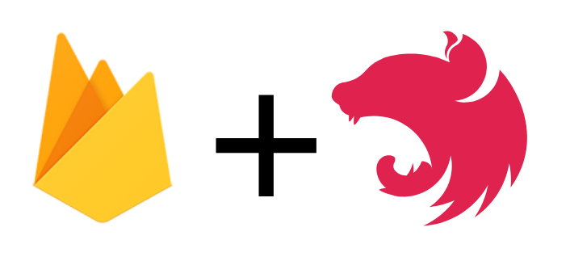

# FAN-Stack Helpers

[](https://npmjs.com/package/@fan-stack/helpers)
[](https://travis-ci.com/fan-stack/helpers)
[](http://commitizen.github.io/cz-cli/)
[](https://github.com/semantic-release/semantic-release)
[](https://david-dm.org/fan-stack/helpers)
[](https://david-dm.org/fan-stack/helpers?type=dev)

[](https://github.com/pfa-stack/helpers)

# How to use it

## How to install

### Yarn

`yarn add @fan-stack/helpers`

### Npm

`npm i @fan-stack/helpers`

### Pnpm

`pnpm i @fan-stack/helpers`

## Single Function

Replace NestJS main.ts file with the following

```ts
import { https } from 'firebase-functions';
import { nestToFirebase } from '@fan-stack/helpers';
import { AppModule } from './app.module';

export const api = https.onRequest(nestToFirebase(AppModule));
```

If you run `firebase serve --only functions`(after building the project) you will see the function is up and running.

## Multiple functions

Having only one function for all the endpoints may not be the best approach for you, to solve that, the only thing you need to do is to export a new function using a different module. Because the AppModule is normally the one with everything, you would normally not use it when exporting multiple functions:

```ts
import { https } from 'firebase-functions';
import { nestToFirebase } from '@fan-stack/helpers';
import { AccountModule } from './account/account.module';
import { ReviewsModule } from './reviews/reviews.module';
import { RestaurantsModule } from './restaurants/restaurants.module';

export const account = https.onRequest(nestToFirebase(AccountModule));
export const reviews = https.onRequest(nestToFirebase(ReviewsModule));
export const restaurants = https.onRequest(nestToFirebase(RestaurantsModule));
```

This would create 3 different function instances where you can set the timeout, memory and any other configuration for each function in case you need to.

# Firebase configuration

You will need to configure your project to work with Firebase before using this. Here is a simple way of doing it:

## Add firebase.json file

```json
{
  "functions": {
    "source": "."
  }
}
```

For this case, the source of the functions is in the root folder, if you have your NestJS project in a sub-folder, change the `source` property to the respective subfolder.

## Add a .firebaserc file

```json
{
  "projects": {}
}
```

## Add Firebase packages

You will need `firebase-functions`, `firebase-admin`, and `firebase-tools`.

### Dependencies

`yarn add firebase-functions firebase-admin`

### Dev Dependencies

`yarn add -D firebase-tools`

### Init your Firebase CLI

Login with the CLI if you haven't logged in already by running `yarn firebase login` then run

`yarn firebase use --add`

This will ask you to select your project and then ask for the alias name to use, normally you can use `default` as the alias, the project ID from the project you choose will be added to the `.firebaserc` file.

## Emulate Firebase Functions

If you plan to emulate the functions using the Firebase CLI, you may want to use the following trick:

`yarn config set ignore-engines true`

This will allow yarn to install the [Google Cloud Functions Emulator](https://github.com/GoogleCloudPlatform/cloud-functions-emulator) because that package supports only Node.js v6.11.5, the latest code already supports newer versions but it hasn't been released to NPM yet.

Now you will need to remove your `node_modules` folder and run `yarn` again to install the dependencies including the emulator.
